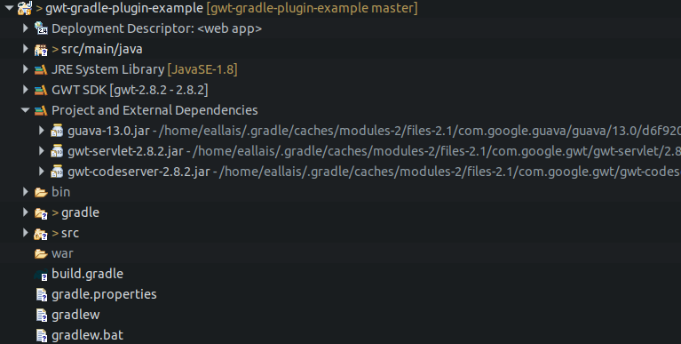

# gwt-gradle-plugin-example

Here is the bug with GWT Gradle plugin:

For some reason `commons-logging` dependency is missing from Gradle container classpath (i.e. Project and External Dependencies in Eclipse IDE) but not guava dependency which is added correctly.

Any ideas why ?

